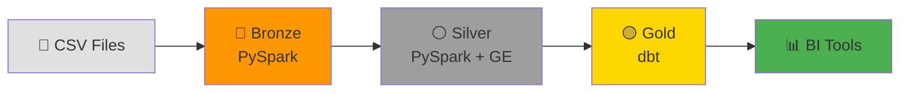

# Campaign Analytics Pipeline

> **End-to-end data pipeline** implementing Bronze/Silver/Gold (Medallion) architecture with PySpark, dbt, and Great Expectations

[](https://www.python.org/downloads/)
[](https://spark.apache.org/)
[](https://www.getdbt.com/)
[](https://www.postgresql.org/)
[](https://www.docker.com/)
[](https://github.com/Franklin0603/campaign_analytics_pipeline/actions/workflows/dbt_ci.yml)
[](https://github.com/Franklin0603/campaign_analytics_pipeline/actions/workflows/python_lint.yml)

## 📋 Overview

This project demonstrates a **production-ready data pipeline** for campaign analytics, showcasing:

- ✅ **Medallion Architecture** (Bronze → Silver → Gold)
- ✅ **PySpark** for distributed data processing
- ✅ **dbt** for analytics engineering
- ✅ **Great Expectations** for data quality validation
- ✅ **PostgreSQL** as the data warehouse
- ✅ **Docker** for easy setup and reproducibility
- ✅ **CI/CD** with GitHub Actions (automated testing)
- ✅ **Modular, testable, and maintainable** code structure

### Architecture
```
┌─────────────────┐
│  BRONZE LAYER   │  ← Raw data preservation
│  (PySpark)      │     • Campaigns
│                 │     • Performance
│  PostgreSQL     │     • Advertisers
└────────┬────────┘
         ↓
┌─────────────────┐
│  SILVER LAYER   │  ← Data transformation & quality
│  (PySpark +     │     • Type casting
│   Great Exp.)   │     • Deduplication
│                 │     • Business rules
│  PostgreSQL     │     • Quality checks
└────────┬────────┘
         ↓
┌─────────────────┐
│   GOLD LAYER    │  ← dbt: Analytics-ready
│   (dbt)         │
│                 │     📋 Staging (3 models)
│                 │        ↓
│                 │     ⚙️  Intermediate (2 models)
│                 │        ↓
│                 │     🏛️  Marts (4 models)
│                 │        • 2 Dimensions
│                 │        • 1 Fact (incremental)
│                 │        • 1 Analytics
└────────┬────────┘
         ↓
┌─────────────────┐
│  BI/Analytics   │  ← Tableau, Looker, Excel
└─────────────────┘
```

**For interactive diagrams:** [View on GitHub →](docs/architecture/diagrams.md)


## 📐 Architecture

### High-Level Overview


**📊 [View Complete Architecture Diagrams →](docs/architecture/diagrams.md)**

Includes:
- End-to-end pipeline flow
- dbt DAG with lineage
- Star schema ERD
- CI/CD pipeline
- Test coverage
- Data refresh schedule

---

## 🚀 Quick Start

### Option 1: Docker Setup (Recommended) 🐳

**Fastest way to get started!**
```bash
# 1. Clone the repository
git clone https://github.com/Franklin0603/campaign_analytics_pipeline.git
cd campaign_analytics_pipeline

# 2. Start PostgreSQL with Docker
docker compose up -d

# 3. Verify database is running
docker ps
# Should see: campaign_analytics_db

# 4. Create virtual environment and install dependencies
python3 -m venv venv
source venv/bin/activate
pip install -r requirements.txt

# 5. Run the pipeline
python run_pipeline.py

# 6. Run dbt models
cd dbt_project
dbt run
dbt test
```

**That's it!** Database is ready with all schemas created automatically.

📖 **For detailed Docker instructions, see [DOCKER_SETUP.md](DOCKER_SETUP.md)**

---

### Option 2: Manual Setup

#### Prerequisites

- Python 3.8+
- PostgreSQL 15+ (installed locally)
- Java 8+ (for PySpark)
- 2GB RAM minimum

#### Installation
```bash
# 1. Clone the repository
git clone https://github.com/Franklin0603/campaign_analytics_pipeline.git
cd campaign_analytics_pipeline

# 2. Create virtual environment
python3 -m venv venv
source venv/bin/activate  # On Windows: venv\Scripts\activate

# 3. Install dependencies
pip install -r requirements.txt

# 4. Download PostgreSQL JDBC driver
mkdir lib
cd lib
curl -O https://jdbc.postgresql.org/download/postgresql-42.6.0.jar
cd ..

# 5. Setup PostgreSQL database
createdb campaign_analytics
psql campaign_analytics < sql/create_schemas.sql
```

#### Configuration

Edit `config/database.yaml` with your PostgreSQL credentials:
```yaml
postgres:
  host: localhost
  port: 5432
  database: campaign_analytics
  user: postgres
  password: "your_password"  # Add your password
```

#### Run the Pipeline
```bash
# Run Bronze → Silver layers
python run_pipeline.py

# Initialize dbt (first time only)
dbt init dbt_project
# Follow prompts with your PostgreSQL credentials

# Run dbt models (Gold layer)
cd dbt_project
dbt run
dbt test
dbt docs generate
dbt docs serve
```

## 📁 Project Structure
```
campaign_analytics_pipeline/
├── data/
│   └── raw/                    # Sample CSV data
│       ├── campaigns.csv
│       ├── performance.csv
│       └── advertisers.csv
├── pipeline/
│   ├── bronze/                 # Bronze layer ingestion
│   │   ├── ingest_campaigns.py
│   │   ├── ingest_performance.py
│   │   └── ingest_advertisers.py
│   ├── silver/                 # Silver layer transformations
│   │   ├── clean_campaigns.py
│   │   ├── clean_performance.py
│   │   └── clean_advertisers.py
│   └── utils/                  # Shared utilities
│       └── spark_postgres.py
├── dbt_project/                # dbt analytics models
│   ├── models/
│   │   ├── staging/           # Staging views (3 models)
│   │   ├── intermediate/      # Business logic (2 models)
│   │   └── marts/             # Final dimensions & facts (4 models)
│   ├── macros/                # 6 custom macros
│   ├── tests/                 # 110 data quality tests
│   │   ├── generic/          # 6 custom generic tests
│   │   └── singular/         # 4 singular tests
│   └── snapshots/            # 2 SCD Type 2 snapshots
├── scripts/
│   └── init_db.sql            # Docker database initialization
├── config/
│   └── database.yaml          # Database configuration
├── sql/
│   └── create_schemas.sql     # Schema setup
├── quality_reports/           # Data quality reports
├── docker-compose.yml         # Docker setup
├── DOCKER_SETUP.md            # Docker documentation
├── run_pipeline.py            # Master pipeline runner
├── requirements.txt           # Python dependencies
├── LICENSE                    # MIT License
├── CHANGELOG.md               # Version history
└── README.md                  # This file
```

## 🔄 Pipeline Stages

### Bronze Layer (Raw Data)
- **Purpose**: Preserve raw data exactly as received
- **Technology**: PySpark
- **Schema**: `bronze.raw_*`
- **Features**:
  - No transformations
  - All columns as STRING type
  - Metadata columns for lineage
  - Append-only writes

### Silver Layer (Cleansed Data)
- **Purpose**: Transform and validate data
- **Technology**: PySpark + Great Expectations
- **Schema**: `silver.*`
- **Features**:
  - Type casting and validation
  - Deduplication
  - Business rule application
  - Data quality checks
  - Calculated fields (CTR, CPC, etc.)

### Gold Layer (Analytics)
- **Purpose**: Business-ready analytics models
- **Technology**: dbt 1.9.0
- **Schema**: `analytics.*, core.*, staging.*`
- **Features**:
  - **9 production models**: 3 staging, 2 intermediate, 4 marts
  - **Star schema**: 2 dimensions, 1 fact table
  - **6 custom macros** for code reusability
  - **110 comprehensive tests**
  - **2 SCD Type 2 snapshots** for historical tracking
  - Complete documentation and lineage

## 📊 Data Model

### Source Tables (Bronze)
- `bronze.raw_campaigns` - Campaign master data
- `bronze.raw_performance` - Daily performance metrics
- `bronze.raw_advertisers` - Advertiser information

### Cleansed Tables (Silver)
- `silver.campaigns` - Validated campaigns with derived fields
- `silver.performance` - Metrics with CTR, CPC, conversion rates
- `silver.advertisers` - Standardized advertiser data

### Analytics Tables (Gold)
- `staging.stg_campaigns` - Staging view (1:1 with silver)
- `staging.stg_advertisers` - Staging view (1:1 with silver)
- `staging.stg_performance` - Staging view (1:1 with silver)
- `intermediate.int_campaigns_enriched` - Campaigns with advertiser info
- `intermediate.int_performance_metrics` - KPI calculations
- `core.dim_campaigns` - Campaign dimension
- `core.dim_advertisers` - Advertiser dimension
- `core.fact_performance` - Performance fact table (incremental)
- `analytics.campaign_performance_summary` - Aggregated metrics

## 🔍 Data Quality

The pipeline includes comprehensive data quality checks:

**PySpark Layer (Great Expectations):**
- ✅ Schema validation
- ✅ Null checks
- ✅ Uniqueness constraints
- ✅ Range validation
- ✅ Business rule enforcement

**dbt Layer (110 Tests):**
- ✅ Primary key uniqueness (all models)
- ✅ Foreign key relationships
- ✅ Custom generic tests (6):
  - `is_percentage` - Values between 0-100
  - `is_non_negative` - No negative values
  - `clicks_lte_impressions` - Funnel validation
  - `conversions_lte_clicks` - Funnel validation
  - `end_date_after_start_date` - Date logic
  - `recency` - Data freshness
- ✅ Custom singular tests (4):
  - No future performance dates
  - Campaigns have performance data
  - Budget consistency
  - Metric consistency

Quality check results are logged and can fail the pipeline if critical issues are detected.

## 🧪 Testing
```bash
# Test Bronze ingestion
python pipeline/bronze/ingest_campaigns.py

# Test Silver transformation
python pipeline/silver/clean_campaigns.py

# Test dbt models
cd dbt_project
dbt test

# Verify data in PostgreSQL
psql campaign_analytics -c "SELECT COUNT(*) FROM silver.campaigns;"
psql campaign_analytics -c "SELECT * FROM core.dim_campaigns LIMIT 5;"

# Or with Docker:
docker exec -it campaign_analytics_db psql -U dbt_user -d campaign_analytics \
  -c "SELECT COUNT(*) FROM core.dim_campaigns;"
```

## 📈 Key Metrics Calculated

The pipeline automatically calculates:

- **Click-Through Rate (CTR)**: `(clicks / impressions) × 100`
- **Conversion Rate (CVR)**: `(conversions / clicks) × 100`
- **Cost Per Click (CPC)**: `spend / clicks`
- **Cost Per Acquisition (CPA)**: `spend / conversions`
- **Return on Investment (ROI)**: `((revenue - cost) / cost) × 100`
- **Campaign Duration**: `end_date - start_date`
- **Budget Tier**: Small (<$10K), Medium (<$50K), Large (>$50K)

All calculations use safe division to handle zero values gracefully.

## 🛠️ Technologies Used

| Component | Technology | Purpose |
|-----------|-----------|---------|
| **Data Processing** | PySpark 3.4 | Distributed data transformation |
| **Analytics** | dbt 1.9.0 | SQL-based modeling & testing |
| **Data Quality** | Great Expectations | Validation framework |
| **Database** | PostgreSQL 15 | Data warehouse |
| **Containerization** | Docker | Easy setup & reproducibility |
| **Language** | Python 3.8+ | Pipeline orchestration |

## 🎯 Use Cases

This pipeline architecture is suitable for:

- Marketing analytics platforms
- Campaign performance tracking
- Multi-source data integration
- Data quality monitoring
- Analytics engineering workflows
- Portfolio demonstration for data engineering roles

## 🐳 Docker Management
```bash
# Start database
docker compose up -d

# Stop database
docker compose down

# View logs
docker compose logs -f postgres

# Access database
docker exec -it campaign_analytics_db psql -U dbt_user -d campaign_analytics

# Reset everything (deletes data!)
docker compose down -v
```

For detailed Docker instructions, see [DOCKER_SETUP.md](DOCKER_SETUP.md).

## 📝 Development Notes

### Adding New Data Sources

1. Create CSV in `data/raw/`
2. Add ingestion script in `pipeline/bronze/`
3. Add transformation in `pipeline/silver/`
4. Create dbt model in `dbt_project/models/`
5. Add tests in `dbt_project/tests/`

### Extending Transformations

Silver layer transformations can be extended with:
- Additional calculated fields
- More complex business rules
- Advanced data quality checks
- ML feature engineering

### dbt Best Practices Implemented
- ✅ Layered architecture (staging → intermediate → marts)
- ✅ Custom macros for DRY code (40% reduction)
- ✅ Comprehensive testing (110 tests)
- ✅ Incremental models for performance
- ✅ SCD Type 2 snapshots for history
- ✅ Complete documentation

## 🤝 Contributing

Contributions welcome! Areas for enhancement:
- Airflow/Prefect orchestration
- Delta Lake integration
- Advanced aggregations
- Real-time streaming ingestion
- CI/CD pipeline
- dbt Elementary for observability

## 📧 Contact

**Franklin Ajisogun**  
*Senior Data Analytics Engineer*

- LinkedIn: [linkedin.com/in/franklin-ajisogun](https://linkedin.com/in/franklin-ajisogun)
- GitHub: [@Franklin0603](https://github.com/Franklin0603)
- Email: franklin.ajisogun03@gmail.com

## 📄 License

MIT License - See [LICENSE](LICENSE) file for details.

---

**Built with** ❤️ **by Franklin Ajisogun** | Demonstrating modern data engineering practices
