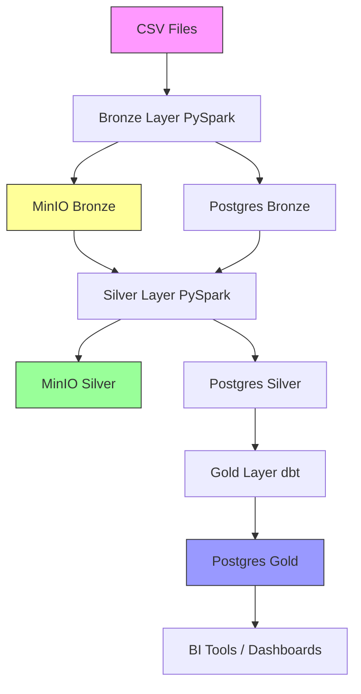

# Campaign Analytics - Data Flow

## End-to-End Pipeline


## Layer Details

### Bronze Layer
- **Input**: CSV files from `data/raw/`
- **Process**: PySpark ingestion
- **Output**: 
  - MinIO: `s3a://bronze/{table}/date=YYYY-MM-DD/` (Parquet)
  - Postgres: `bronze.raw_{table}` (tables)
- **Metadata**: `_ingestion_timestamp`, `_source_file`, `_batch_id`

### Silver Layer
- **Input**: MinIO Bronze Parquet files
- **Process**: PySpark transformations + Great Expectations
- **Output**:
  - MinIO: `s3a://silver/{table}/partition_col=value/` (Parquet)
  - Postgres: `silver.{table}` (tables for dbt)
- **Metadata**: `_silver_processed_at`

### Gold Layer
- **Input**: Postgres Silver tables
- **Process**: dbt SQL transformations
- **Output**: Postgres `core.*` and `analytics.*` schemas
- **Structure**: Star schema (dimensions + facts)

## Storage Strategy

| Layer | MinIO | Postgres | Why |
|-------|-------|----------|-----|
| Bronze | ✅ Primary | ✅ Mirror | MinIO = cheap archive; Postgres = queryable |
| Silver | ✅ Primary | ✅ For dbt | MinIO = data lake; Postgres = warehouse input |
| Gold | ❌ | ✅ Only | BI tools query Postgres (fast SQL) |

## Query Patterns

### Pattern 1: Deep Analysis (Use MinIO)
```python
# Query MinIO directly with Spark for large scans
df = spark.read.parquet("s3a://silver/performance/")
df.filter(df.date > '2024-01-01').groupBy('campaign_id').sum('revenue')
```

### Pattern 2: BI Dashboard (Use Postgres)
```sql
-- Fast aggregated queries on Gold layer
SELECT campaign_name, SUM(revenue) 
FROM analytics.campaign_performance_summary
WHERE performance_date > '2024-01-01'
GROUP BY campaign_name;
```

### Pattern 3: Data Quality Audit (Use Both)
```sql
-- Compare Bronze vs Silver record counts
SELECT 
  (SELECT COUNT(*) FROM bronze.raw_campaigns) as bronze_count,
  (SELECT COUNT(*) FROM silver.campaigns) as silver_count;
```