# Campaign Analytics Pipeline - Architecture Diagrams

> **Visual documentation of the end-to-end data pipeline**

---

## 📊 Table of Contents

1. [End-to-End Pipeline Architecture](#1-end-to-end-pipeline-architecture)
2. [dbt DAG (Lineage Graph)](#2-dbt-dag-lineage-graph)
3. [Star Schema - Dimensional Model](#3-star-schema---dimensional-model)
4. [Data Flow by Layer](#4-data-flow-by-layer)
5. [CI/CD Pipeline](#5-cicd-pipeline)
6. [Test Coverage Architecture](#6-test-coverage-architecture)
7. [Data Refresh Schedule](#7-data-refresh-schedule)
8. [Macro Usage Architecture](#8-macro-usage-architecture)
9. [Staging Layer Lineage](#9-staging-layer-lineage)
10. [Intermediate Layer Lineage](#10-intermediate-layer-lineage)
11. [Marts Layer Lineage](#11-marts-layer-lineage)
12. [Test Distribution](#12-test-distribution)

---

## 1. End-to-End Pipeline Architecture

```mermaid
graph TB
    subgraph "Data Sources"
        CSV1[📄 campaigns.csv]
        CSV2[📄 performance.csv]
        CSV3[📄 advertisers.csv]
    end
    
    subgraph "Bronze Layer - PySpark"
        B1[🔶 raw_campaigns]
        B2[🔶 raw_performance]
        B3[🔶 raw_advertisers]
    end
    
    subgraph "Silver Layer - PySpark + Great Expectations"
        S1[⚪ campaigns]
        S2[⚪ performance]
        S3[⚪ advertisers]
        GE[✓ Data Quality Validation]
    end
    
    subgraph "Gold Layer - dbt"
        subgraph "Staging"
            ST1[📋 stg_campaigns]
            ST2[📋 stg_performance]
            ST3[📋 stg_advertisers]
        end
        
        subgraph "Intermediate"
            INT1[⚙️ int_campaigns_enriched]
            INT2[⚙️ int_performance_metrics]
        end
        
        subgraph "Marts - Core"
            DIM1[🔷 dim_campaigns]
            DIM2[🔷 dim_advertisers]
            FACT[📊 fact_performance]
        end
        
        subgraph "Marts - Analytics"
            AGG[📈 campaign_performance_summary]
        end
        
        subgraph "Snapshots"
            SNAP1[📸 campaigns_snapshot]
            SNAP2[📸 advertisers_snapshot]
        end
    end
    
    subgraph "Consumption Layer"
        BI1[📊 Tableau]
        BI2[📊 Looker]
        BI3[📊 Excel]
    end
    
    CSV1 --> B1
    CSV2 --> B2
    CSV3 --> B3
    
    B1 --> S1
    B2 --> S2
    B3 --> S3
    
    S1 --> GE
    S2 --> GE
    S3 --> GE
    
    S1 --> ST1
    S2 --> ST2
    S3 --> ST3
    
    ST1 --> INT1
    ST3 --> INT1
    ST2 --> INT2
    
    INT1 --> DIM1
    ST3 --> DIM2
    INT2 --> FACT
    
    FACT --> AGG
    DIM1 --> AGG
    
    ST1 --> SNAP1
    ST3 --> SNAP2
    
    DIM1 --> BI1
    DIM2 --> BI1
    FACT --> BI1
    AGG --> BI2
    AGG --> BI3
    
    style B1 fill:#ff9800
    style B2 fill:#ff9800
    style B3 fill:#ff9800
    style S1 fill:#9e9e9e
    style S2 fill:#9e9e9e
    style S3 fill:#9e9e9e
    style ST1 fill:#4caf50
    style ST2 fill:#4caf50
    style ST3 fill:#4caf50
    style INT1 fill:#2196f3
    style INT2 fill:#2196f3
    style DIM1 fill:#9c27b0
    style DIM2 fill:#9c27b0
    style FACT fill:#f44336
    style AGG fill:#00bcd4
```

---

## 2. dbt DAG (Lineage Graph)

---

## 3. Star Schema - Dimensional Model

---

## 4. Data Flow by Layer

```mermaid
flowchart TD
    subgraph Bronze["🔶 Bronze Layer - Raw Data Preservation"]
        B1[All columns as STRING]
        B2[No transformations]
        B3[Append-only writes]
        B4[Metadata tracking]
    end
    
    subgraph Silver["⚪ Silver Layer - Cleaned & Validated"]
        S1[Type casting]
        S2[Deduplication]
        S3[Business rules]
        S4[Quality checks]
        S5[Derived fields]
    end
    
    subgraph Gold["🟡 Gold Layer - Analytics Ready"]
        G1[Staging: 1:1 transformation]
        G2[Intermediate: Business logic]
        G3[Marts: Star schema]
        G4[Tests: 102 validations]
    end
    
    Bronze --> Silver
    Silver --> Gold
    
    style Bronze fill:#ff9800,color:#000
    style Silver fill:#9e9e9e,color:#000
    style Gold fill:#ffd700,color:#000
```

---

## 5. CI/CD Pipeline

```mermaid
flowchart LR
    A[💻 Git Push] --> B{GitHub Actions}
    
    B --> C[🐍 Python Lint]
    B --> D[📝 SQL Lint]
    B --> E[🔧 dbt CI]
    
    E --> E1[🐘 Start PostgreSQL]
    E1 --> E2[📊 Generate Sample Data]
    E2 --> E3[⬆️ Load to Silver]
    E3 --> E4[🔨 dbt compile]
    E4 --> E5[▶️ dbt run<br/>9 models]
    E5 --> E6[✅ dbt test<br/>102 tests]
    E6 --> E7[📚 dbt docs generate]
    
    C --> F{All Pass?}
    D --> F
    E7 --> F
    
    F -->|✅ Yes| G[🟢 Merge to Main]
    F -->|❌ No| H[🔴 Block Merge]
    
    style A fill:#4caf50
    style G fill:#4caf50
    style H fill:#f44336
    style F fill:#ff9800
```

---

## 6. Test Coverage Architecture

---

## 7. Data Refresh Schedule

---

## 8. Macro Usage Architecture

```mermaid
graph TB
    subgraph "Custom Macros - 6 Total"
        M1[safe_divide]
        M2[calculate_campaign_kpis]
        M3[get_performance_tier]
        M4[cents_to_dollars]
        M5[date_spine]
        M6[generate_schema_name]
    end
    
    subgraph "Models Using Macros"
        INT2[int_performance_metrics]
        FACT[fact_performance]
        AGG[campaign_performance_summary]
    end
    
    M1 --> INT2
    M1 --> FACT
    M2 --> INT2
    M3 --> INT2
    M3 --> FACT
    
    INT2 -.40% code reduction.-> CodeReuse[📉 DRY Principles Applied]
    
    style M1 fill:#2196f3
    style M2 fill:#2196f3
    style M3 fill:#2196f3
    style CodeReuse fill:#4caf50
```

---

## 9. Staging Layer Lineage

---

## 10. Intermediate Layer Lineage

---

## 11. Marts Layer Lineage

---

## 12. Test Distribution

---

## 📝 Notes

- All diagrams render automatically on GitHub using Mermaid
- Color coding: Bronze (🔶), Silver (⚪), Staging (🟢), Intermediate (🔵), Marts (🟣/🔴), Analytics (🔵)
- For interactive lineage, run `dbt docs serve` and view the DAG